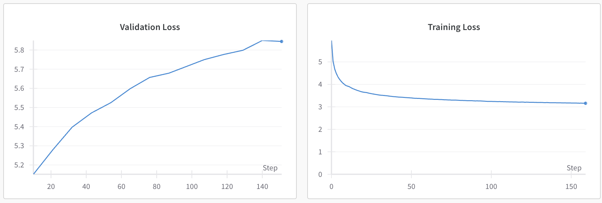

# Decoder-Transformer

This repository contains a decoder-only Transformer model, which is a variant of the architecture presented in the 'Attention is All You Need' paper. The model is specifically designed for next-word prediction in English text. ~~While the data preprocessing and training steps have not yet been completed, the plan is to acquire a corpus of English text, preprocess it using tokenizers to create input-target pairs, and then train the model using GPUs on Google Colab.~~ The goal is to develop a model that can predict the next token in a sentence, akin to the early versions of the GPT series. A final version of the auto-regressive transformer (30M params) is trained on 1.4B tokens of openwebtext on an A100 google colab gpu. Skip to gpt-mini-background.ipynb to see the final version. The data preprocessing is done in prepare.ipynb, the dataloading, model config, and training loops are all done on gpt-mini-background.ipynb. Training loss, validation loss, and number of iterations are logged using weights and biases, wandb. 

### decodemodel.py

File contains a decoder-only transformer model based off of the original transformer model. The hyperparameters are kept mostly the same. Layer normalization and positional encodings are implemented directly without using pytorch methods and modules. The large amount of parameters prevents training with current gpus. 

### gpt-solo.py

This py file contains a comprehensive end-to-end process of training a decoder-only transformer. Similar to OpenAI's gpt-2 model (small), it is trained on a corpus of text, capable of text generation. It is trained on Andrej Karpathy's tiny-Shakespeare, a text file that contains all Shakespeare's text in one file. The text is preprocessed by tokenizing, cleaning, and formatting, and then created into batches using tensors. These tensors are passed through the gpt model (100M parameters), and trained using Adam. Google colab's A100s are used to train this model. 

### gpt-2-training-pipeline.ipynb

This ipython notebook file contains a newly developed end-to-end training pipeline for a decoder model on a openwebtext dataset. The 20 gb text corpus is downloaded off of huggingface datasets, and preprocessed into a memmap to efficiently allow dataloading without overloading system RAM. This is necessary for efficient use of memory and computational resources in the google colab environmnent. The datapreprocessing and the training process is a work-in-progress. (a single a100 gpu on google colab is still not enough to train a model this big on a large amount of data.)

### gpt-mini-background.ipynb and prepare.ipynb

These google colab notebooks are the final product of the end-to-end decoder model training pipeline. prepare.ipynb creates a small subset of the original openwebtext dataset and reduces it down to 10,000 rows. There are 176,000 batches with batch size 64 and sequence length 128. The 30M parameter decoder-only model is trained on a total of 1.4B tokens of openwebtext from huggingface. The final product is trained on a fraction of the initial data because of its memory and computational resource limitations. 1 epoch is predicted to take around 6 hours to train, and it is currently training using google colab A100 gpus on background execution. Data on training loss and outcome will be presented later. 

